<div align="center">

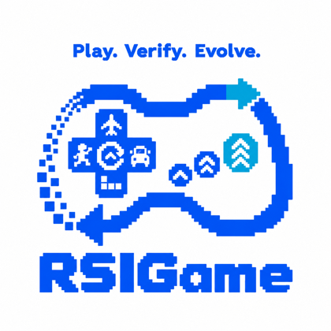

# RSIGame: Autonomous Agentic Game Development with Recursive Self-improvement

**Play. Verify. Evolve.**

[](https://anonymous312874-rsigame-page.static.hf.space/)
[](https://huggingface.co/datasets/anonymous312874/rsigame-scoring-artifacts)
[](LICENSE)
[](https://www.python.org/)

> *"A poem is never finished, only abandoned."*
> — **Paul Valéry**

**Neither is a generated game. RSIGame keeps developing what it creates —
autonomously exploring, improving, and verifying the game until progress
saturates, then preserving the best version or opening a new stage of
evolution through high-level guidance.**

</div>

<div align="center">
  <a href="assets/rsigame_demo.mp4">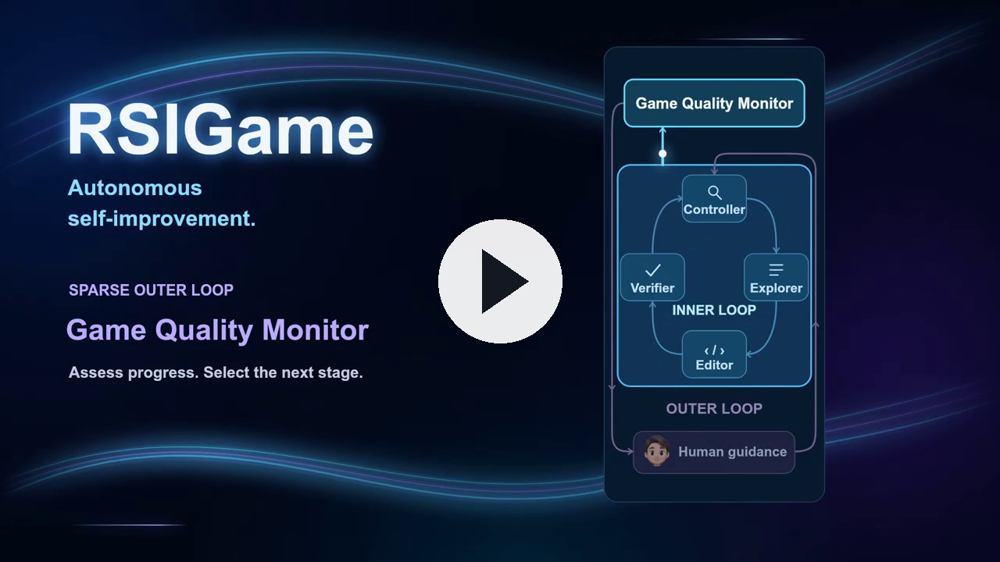</a>
  <br><em>A 72-second narrated walkthrough &mdash; the loop, worked through one
  game from its first playable version to the build development delivers, and
  what it does across the benchmark. Click to play, with sound.</em>
</div>

<div align="center">
  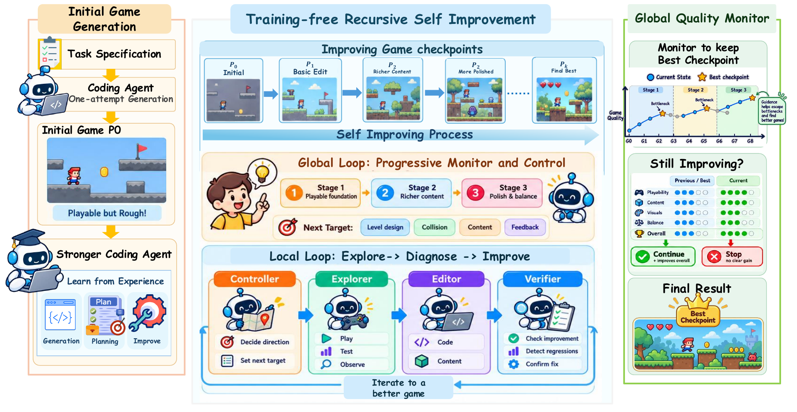
</div>

## Abstract

> Recent advances in large language models have made automatic game generation increasingly feasible, yet reliably improving generated games beyond a playable version remains challenging. Naive iterative refinement can easily overfit a small set of test cases, producing fragile games with unresolved bugs, missing behaviors, and poor generalization to broader player interactions.
>
> We introduce **RSIGame**, an autonomous agentic game development framework with recursive self-improvement. RSIGame organizes development into complementary local and global loops. Concretely, a local *explore-diagnose-improve* loop broadly explores the executable game, diagnoses and prioritizes discovered issues, and performs evidence-grounded revision, where an evolving checklist continually accumulates new testing and improvement guidance. A global loop tracks overall quality, preserves the best checkpoint, and detects saturation or regression over long-horizon development. Beyond test-time improvement, RSIGame further internalizes successful development experience into the generator through training.
>
> Across 140 GameCraft-Bench tasks, two game engines, and five generators, RSIGame consistently improves game quality under matched development budgets. Notably, iterative development with Qwen3.8-27B reaches 53.90 on Godot and 50.24 on Phaser, surpassing the one-shot performance of substantially stronger GPT-5.5-based generators.

## What development does

Left is the initial generation, right is what RSIGame delivers. Same game, same
scripted inputs, replayed on both builds.

<table align="center">
<tr>
  <td align="center">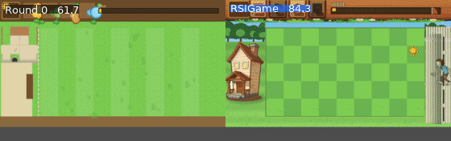<br><em>Lawn Guardians · tower defence · Godot<br>61.7 → 84.3 over 55 rounds</em></td>
  <td align="center">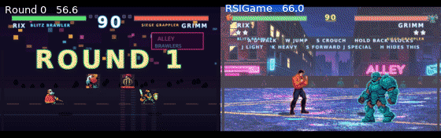<br><em>Alley Brawlers · fighting · Phaser<br>56.6 → 66.0 over 41 rounds</em></td>
</tr>
<tr>
  <td align="center">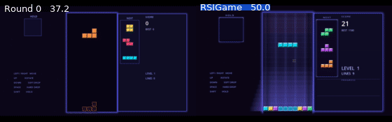<br><em>Block Drop · puzzle · Phaser<br>37.2 → 50.0</em></td>
  <td align="center">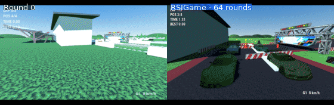<br><em>Circuit GT · racing 3D · Godot<br>64 rounds</em></td>
</tr>
<tr>
  <td align="center">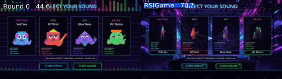<br><em>Rhythm DJ Arena · rhythm · Godot<br>44.6 → 70.7 over 30 rounds</em></td>
  <td align="center">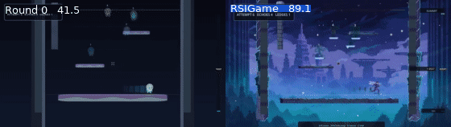<br><em>Echo Climb · platformer · Godot<br>41.5 → 89.1 over 30 rounds</em></td>
</tr>
<tr>
  <td align="center">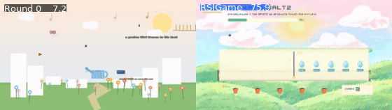<br><em>Rhythm Garden · rhythm · Godot<br>7.2 → 75.9 over 30 rounds</em></td>
  <td align="center">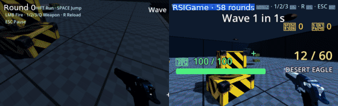<br><em>FPS Arena · shooter 3D · Godot<br>58 rounds</em></td>
</tr>
</table>

<div align="center"><em>More at the <a href="https://anonymous312874-rsigame-page.static.hf.space/">project page</a>, where four of these are playable in the browser</em></div>

## How it works

**The inner loop**, once per round:

| | |
|---|---|
| **Explore** | an agent plays the executable game and records what actually happens — logs, metrics, screenshots |
| **Diagnose** | that evidence becomes one concrete objective: the place with the most improvement headroom, not a guess |
| **Edit** | a repair agent changes code or content against that single objective |
| **Verify** | an independent agent replays the game: did the change land, and did anything that worked before break |

**The outer loop**, across rounds. A Global Quality Monitor scores progress,
holds the globally best checkpoint, and detects saturation — three consecutive
checkpoints where nothing beat the held build. Saturation is not the end: sparse
high-level guidance, from a person or a stronger model, opens the next stage.

<div align="center">
  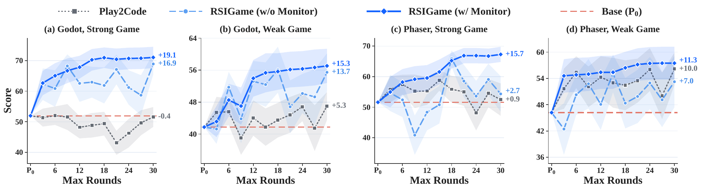
  <br><em>Mean Overall of the build a budget of <i>k</i> rounds delivers. A free-form
  playtest-and-revise baseline finishes a strong base where it started; the
  Global Quality Monitor is what keeps late rounds from undoing earlier gains.</em>
</div>

## What this repository is, and is not

It is the RSIGame development loop -- everything that happens once a playable
game exists -- together with the pipeline that trains on what the loop
produces. It is not the baselines it is compared against.

- **Baselines.** The comparison arms of the paper (Play2Code, the round-robin
  direction policy, the multi-agent system of the appendix) are not here. The
  scored artefacts of every arm are published as data, so the numbers can be
  checked without the code that produced them.
- **Initial generation.** Every run starts from a frozen initial project
  P₀. Producing one is a separate pipeline; the frozen projects themselves
  are released, so a run can be reproduced from the same starting point
  without it.
- **Training on the loop's own sessions.** `data_pipeline/` turns recorded
  sessions into a supervised corpus and `training/` fine-tunes on it, which is
  the step that makes the improvement recursive rather than per-run. Neither is
  needed to run the loop: a development run reads none of their configuration,
  and the trained adapters are released.

## Installation

```bash
git clone <this repo> && cd rsigame
pip install -e .
```

**GameCraft-Bench** supplies the tasks, rubrics and replay harness. It is a
separate checkout; install it into the same environment and point the config at
it:

```bash
pip install -e ../gamecraft-bench
```

You also need **Godot 4** for the Godot line, and **Node 20+** with an
[OpenGame](https://github.com/leigest519/OpenGame) checkout for the Phaser line.

## Quick start

```bash
cp .env.example .env            # one model API key is enough
$EDITOR configs/default.toml    # [paths]: the bench checkout and the Godot binary

rsigame config                  # what a run would actually use, resolved
rsigame check                   # paths, keys and models, before anything runs
rsigame develop <task> -c paper_godot_gpt
```

`rsigame check` is worth running first: a missing bench path or key used to
surface at round 12, not at round 0.

### Configuration

Three layers, each overriding the one above:

1. `configs/default.toml` — every knob and the default the code itself uses
2. `-c configs/experiment/<name>.toml` — what one experiment changes
3. environment variables — a temporary override mid-run

Every variable this project owns is `RSIGAME_<SECTION>_<KEY>`, matching
`[section] key` in the toml exactly. Secrets are read from `.env` only, never
from a toml.

### Stopping early

The monitor decides which build is the best seen so far, and Value Stop decides
when development has stopped paying: K consecutive checkpoints with an unchanged
champion. `[monitor] live` picks how it runs:

| | what happens | what a run costs |
|---|---|---|
| `live = false` *(default)* | every round runs; `scripts/vm_replay.py` replays the checkpoints afterwards and `python -m rsigame.monitor.value_stop` reads where the run would have stopped | the full budget, every arm the same — this is what the paper reports |
| `live = true` | the monitor judges each checkpoint as the run goes and **ends the run** when Value Stop fires | fewer rounds, and arms no longer share a budget |

A live monitor never kills a round mid-flight, never rolls the tree back, and
drops itself for the rest of the run if the estimator fails — an outage must not
look like saturation.

## Scoring

Both engines are scored by the same GameCraft-Bench rubric,
**Overall = BUILD × (0.15·Mechanics + 0.35·Depth + 0.15·Visuals + 0.35·Art)**,
by replaying scripted demos and judging the recordings.

```bash
python -m rsigame.eval.score_game --project <tree> --game <task> --output <dir>   # Godot
scripts/score_checkpoints.py      <run root>                                      # Godot, every Nth round
scripts/score_checkpoints_web.py  <run root>                                      # Phaser, every Nth round
```

The engines differ in about 900 lines out of 48k: the build gate (Godot's
headless import against the web build check on `dist/`), how a demo is replayed,
how a project tree is read, and the engine-specific half of the repair prompt.
Everything else is shared.

## Layout

```
src/rsigame/
  loop.py            one development round: explore → diagnose → edit → verify
  project.py         a game project: copy it, build it, import it, read it
  cli.py  config.py  paths.py  preflight.py

  planning/          what a round is for, and what it will work on
  checklist/         what the task asked for, and what is true of it now
  view/              what the build contains, read from the tree
  controller/        how the work is chosen and how the repair is asked for
  evidence/          what was observed, frozen so a later round can cite it
  polish/            the quality pass: the largest remaining bottleneck
  verify/            replay a repair and decide whether it earned its commit
  monitor/           the champion across rounds, and Value Stop
  eval/              scoring, the proxy estimator, pairwise judging
  agent/             the exploration arm: sessions, probes, the repair agent
  review/            the human review tool used for outer guidance

  data_pipeline/     recorded sessions -> a supervised fine-tuning corpus
  training/          the corpus -> a LoRA adapter, merged for serving
configs/             every knob, with its default and a comment
scripts/             scoring and replay entry points
patches/             the changes this work applies to GameCraft-Bench
```

## Data

Base games, run trees, recordings and scores are not in this repo. The scoring
artefacts every number in the paper is read from are at
[anonymous312874/rsigame-scoring-artifacts](https://huggingface.co/datasets/anonymous312874/rsigame-scoring-artifacts); the base games, run trees
and recordings are released with the camera-ready.

The supervised corpus and the adapters trained on it are released the same way:
`data_pipeline/` documents how the corpus is built from recordings and
`training/` how one arm is trained, so both can be rebuilt rather than taken on
trust.

## Notes

- `tests/test_no_leaks.py` runs on every commit: no credentials, no absolute
  machine paths, no internal endpoints, no personal emails, no legacy variable
  names.
- `tests/test_imports_resolve.py` resolves every internal import at any nesting
  depth, including imports inside functions — the kind a passing test suite
  otherwise hides until a real run reaches that line.
- Two prompt strings in `eval/estimator/` are Chinese and stay that way: they are
  sent to the judge, and the paper's numbers were produced with that wording.

## License

Apache-2.0. This work builds on [OpenGame](https://github.com/leigest519/OpenGame)
(Apache-2.0) for the Phaser line and on
[GameCraft-Bench](https://github.com/FreedomIntelligence/gamecraft-bench) for
the tasks and the scoring harness; see `NOTICE`. No source from either is
redistributed here.

## Citation

```bibtex
@inproceedings{rsigame2027,
  title  = {RSIGame: Autonomous Agentic Game Development with Recursive Self-improvement},
  author = {TBA},
  year   = {2027}
}
```
